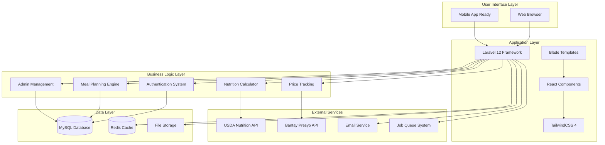
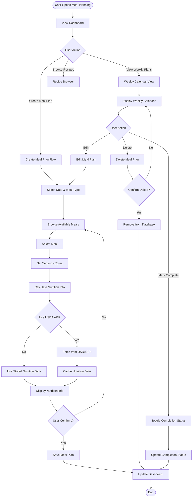
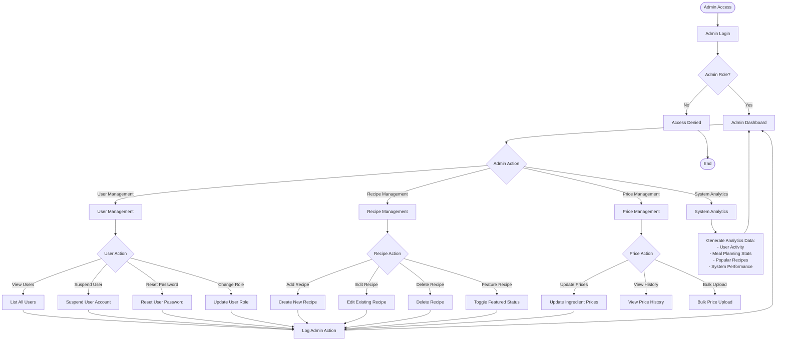
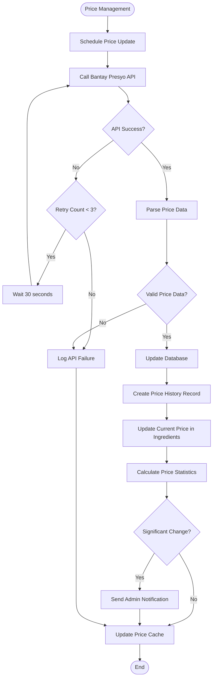
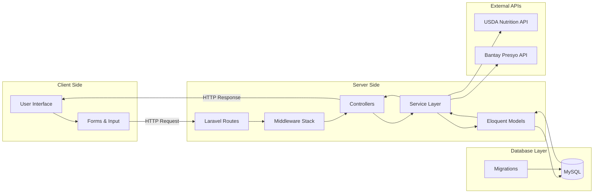

# StudEats - System Flowcharts and Architecture Diagrams

## 1. High-Level System Architecture



## 2. User Authentication Flow

```mermaid
flowchart TD
    START([User Starts Registration]) --> REGISTER[Fill Registration Form]
    REGISTER --> VALIDATE{Valid Data?}
    VALIDATE -->|No| REGISTER
    VALIDATE -->|Yes| CREATE_USER[Create User Account]
    
    CREATE_USER --> SEND_OTP[Send OTP Email]
    SEND_OTP --> VERIFY_FORM[Show OTP Verification Form]
    VERIFY_FORM --> ENTER_OTP[User Enters OTP]
    ENTER_OTP --> CHECK_OTP{Valid OTP?}
    
    CHECK_OTP -->|No| RETRY{Attempts < 5?}
    RETRY -->|Yes| VERIFY_FORM
    RETRY -->|No| BLOCKED[Account Blocked]
    
    CHECK_OTP -->|Yes| VERIFY_EMAIL[Mark Email Verified]
    VERIFY_EMAIL --> LOGIN_TRACKING[Record Login Count]
    LOGIN_TRACKING --> FIRST_LOGIN{First Login?}
    
    FIRST_LOGIN -->|Yes| WELCOME[Show "Welcome [Name]"]
    FIRST_LOGIN -->|No| WELCOME_BACK[Show "Welcome Back [Name]"]
    
    WELCOME --> DASHBOARD[Redirect to Dashboard]
    WELCOME_BACK --> DASHBOARD
    
    BLOCKED --> END([End])
    DASHBOARD --> END
    
    %% Login Flow
    LOGIN_START([User Starts Login]) --> LOGIN_FORM[Enter Credentials]
    LOGIN_FORM --> AUTH_CHECK{Valid Credentials?}
    AUTH_CHECK -->|No| LOGIN_FORM
    AUTH_CHECK -->|Yes| EMAIL_VERIFIED{Email Verified?}
    EMAIL_VERIFIED -->|No| VERIFY_FORM
    EMAIL_VERIFIED -->|Yes| LOGIN_TRACKING
```

## 3. Meal Planning System Flow



## 4. Nutrition Calculation System

```mermaid
flowchart TD
    START([Nutrition Calculation Request]) --> IDENTIFY_SOURCE{Data Source}
    
    IDENTIFY_SOURCE -->|Recipe| RECIPE_CALC[Recipe Calculation]
    IDENTIFY_SOURCE -->|Single Ingredient| INGREDIENT_CALC[Ingredient Calculation]
    
    RECIPE_CALC --> GET_INGREDIENTS[Get Recipe Ingredients]
    GET_INGREDIENTS --> LOOP_INGREDIENTS[For Each Ingredient]
    
    LOOP_INGREDIENTS --> CHECK_CACHE{In Cache?}
    CHECK_CACHE -->|Yes| USE_CACHED[Use Cached Data]
    CHECK_CACHE -->|No| API_REQUEST[Request USDA API]
    
    API_REQUEST --> PARSE_RESPONSE[Parse API Response]
    PARSE_RESPONSE --> EXTRACT_NUTRIENTS[Extract Nutrients:
    - Calories (208)
    - Protein (203)  
    - Carbs (205)
    - Fat (204)
    - Fiber (291)
    - Sugar (269)
    - Sodium (1093)]
    
    EXTRACT_NUTRIENTS --> CACHE_RESULT[Cache Results]
    CACHE_RESULT --> CALCULATE_PORTION[Calculate Per Portion]
    USE_CACHED --> CALCULATE_PORTION
    
    CALCULATE_PORTION --> SUM_NUTRIENTS[Sum All Nutrients]
    SUM_NUTRIENTS --> MORE_INGREDIENTS{More Ingredients?}
    MORE_INGREDIENTS -->|Yes| LOOP_INGREDIENTS
    MORE_INGREDIENTS -->|No| FINAL_CALC[Final Calculation]
    
    INGREDIENT_CALC --> CHECK_CACHE
    
    FINAL_CALC --> APPLY_SERVINGS[Apply Serving Size]
    APPLY_SERVINGS --> RETURN_DATA[Return Nutrition Data]
    RETURN_DATA --> END([End])
    
    %% Error Handling
    API_REQUEST --> API_ERROR{API Error?}
    API_ERROR -->|Yes| LOG_ERROR[Log Error]
    API_ERROR -->|No| PARSE_RESPONSE
    LOG_ERROR --> USE_DEFAULT[Use Default Values]
    USE_DEFAULT --> CALCULATE_PORTION
```

## 5. Admin Management System



## 6. Price Management System Flow



## 7. Email Verification System

```mermaid
flowchart TD
    START([Email Verification]) --> GENERATE_OTP[Generate 6-digit OTP]
    GENERATE_OTP --> CREATE_TOKEN[Create Verification Token]
    CREATE_TOKEN --> STORE_OTP[Store OTP in Database:
    - Email
    - OTP Code  
    - Expires in 5 minutes
    - Not used]
    
    STORE_OTP --> QUEUE_EMAIL[Queue Email Job]
    QUEUE_EMAIL --> SEND_EMAIL[Send OTP Email]
    
    SEND_EMAIL --> EMAIL_SUCCESS{Email Sent?}
    EMAIL_SUCCESS -->|No| EMAIL_RETRY{Retry < 3?}
    EMAIL_SUCCESS -->|Yes| WAIT_INPUT[Wait for User Input]
    
    EMAIL_RETRY -->|Yes| QUEUE_EMAIL
    EMAIL_RETRY -->|No| EMAIL_FAILED[Mark Email Failed]
    
    WAIT_INPUT --> USER_SUBMIT[User Submits OTP]
    USER_SUBMIT --> VALIDATE_OTP{Valid OTP?}
    
    VALIDATE_OTP -->|No| ATTEMPT_COUNT{Attempts < 5?}
    VALIDATE_OTP -->|Yes| CHECK_EXPIRY{Not Expired?}
    
    ATTEMPT_COUNT -->|Yes| SHOW_ERROR[Show Error Message]
    ATTEMPT_COUNT -->|No| RATE_LIMIT[Rate Limit Applied]
    SHOW_ERROR --> WAIT_INPUT
    
    CHECK_EXPIRY -->|No| EXPIRED_OTP[OTP Expired]
    CHECK_EXPIRY -->|Yes| MARK_VERIFIED[Mark Email Verified]
    
    MARK_VERIFIED --> UPDATE_OTP[Mark OTP as Used]
    UPDATE_OTP --> RECORD_LOGIN[Record First Login]
    RECORD_LOGIN --> REDIRECT_DASHBOARD[Redirect to Dashboard]
    
    EXPIRED_OTP --> RESEND_OPTION[Offer Resend Option]
    RESEND_OPTION --> GENERATE_OTP
    
    RATE_LIMIT --> BLOCK_TEMP[Temporary Block (1 hour)]
    EMAIL_FAILED --> SHOW_ERROR
    REDIRECT_DASHBOARD --> END([End])
    BLOCK_TEMP --> END
```

## 8. Data Flow Architecture



## Technology Stack Summary

### **Frontend**
- **TailwindCSS 4.1.12**: Modern utility-first CSS framework
- **React 19.1.1**: Component-based UI library
- **Blade Templates**: Laravel's templating engine

### **Backend**
- **Laravel 12.25.0**: PHP web application framework
- **PHP 8.2.12**: Server-side scripting language
- **MySQL**: Relational database management system

### **External Integrations**
- **USDA FoodData Central API**: Nutrition information
- **Bantay Presyo API**: Philippine market prices
- **Laravel Queues**: Asynchronous job processing
- **Email Services**: User verification and notifications

### **Development Tools**
- **Laravel Pint 1.24.0**: PHP code style fixer
- **Vite**: Frontend build tool
- **Composer**: PHP dependency management
- **npm**: JavaScript package management