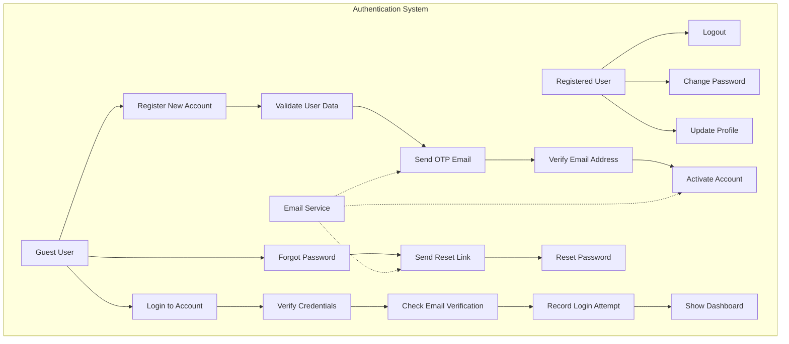
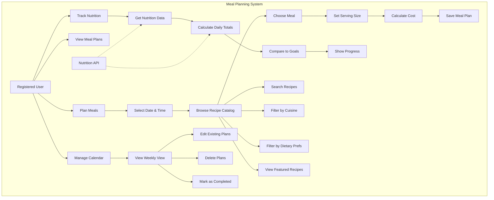
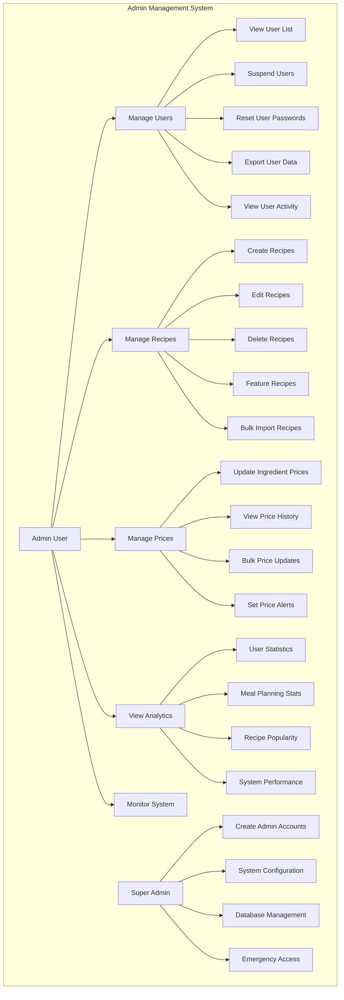
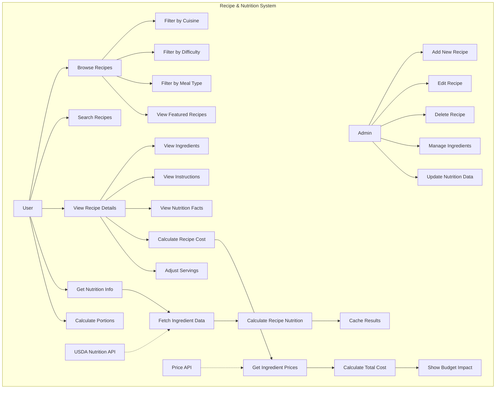
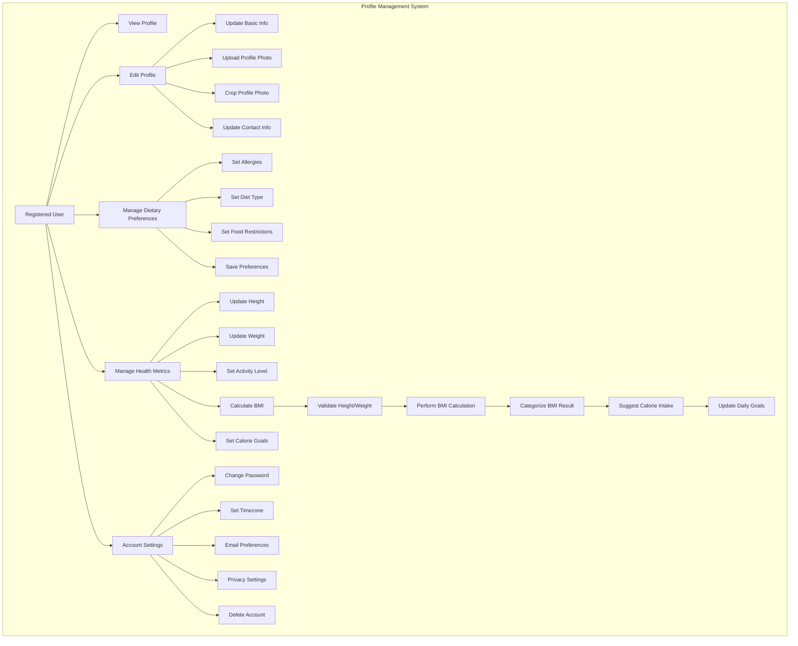
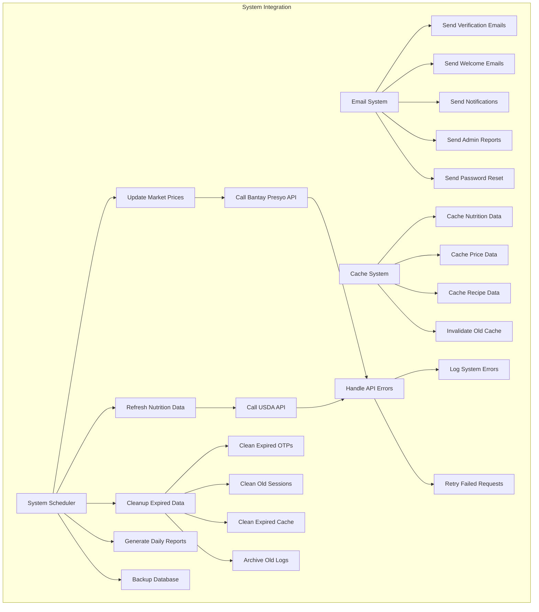

# StudEats - Use Case Diagrams

## 1. Primary Use Case Diagram

```mermaid
graph TD
    %% Actors
    GUEST[👤 Guest User]
    USER[👤 Registered User] 
    ADMIN[👩‍💼 Admin]
    SUPER_ADMIN[👨‍💼 Super Admin]
    SYSTEM[🤖 System/Scheduler]
    
    %% Guest User Use Cases
    GUEST --> UC1[Register Account]
    GUEST --> UC2[Login]
    GUEST --> UC3[Browse Recipes]
    GUEST --> UC4[View Landing Page]
    GUEST --> UC5[Contact Support]
    
    %% Registered User Use Cases  
    USER --> UC6[Manage Profile]
    USER --> UC7[Create Meal Plans]
    USER --> UC8[View Nutrition Info]
    USER --> UC9[Browse Recipe Library]
    USER --> UC10[Track Daily Progress]
    USER --> UC11[Manage Dietary Preferences]
    USER --> UC12[Calculate BMI]
    USER --> UC13[View Weekly Calendar]
    USER --> UC14[Mark Meals Complete]
    USER --> UC15[Search Recipes]
    USER --> UC16[Upload Profile Photo]
    USER --> UC17[Change Password]
    USER --> UC18[Logout]
    
    %% Admin Use Cases
    ADMIN --> UC19[Manage Users]
    ADMIN --> UC20[Manage Recipes]
    ADMIN --> UC21[Update Ingredient Prices]
    ADMIN --> UC22[View System Analytics]
    ADMIN --> UC23[Monitor User Activity]
    ADMIN --> UC24[Manage Market Prices]
    ADMIN --> UC25[Create Admin Reports]
    
    %% Super Admin Use Cases
    SUPER_ADMIN --> UC26[Create Admin Accounts]
    SUPER_ADMIN --> UC27[System Configuration]
    SUPER_ADMIN --> UC28[Database Management]
    SUPER_ADMIN --> UC29[Monitor System Health]
    
    %% System Use Cases
    SYSTEM --> UC30[Update Nutrition Data]
    SYSTEM --> UC31[Refresh Market Prices]
    SYSTEM --> UC32[Send Email Notifications]
    SYSTEM --> UC33[Generate Analytics]
    SYSTEM --> UC34[Clean Expired OTPs]
```

## 2. User Authentication Use Cases

## 3. Meal Planning Use Cases

## 4. Admin Management Use Cases

## 5. Recipe & Nutrition Use Cases

## 6. Profile Management Use Cases

## 7. System Integration Use Cases

## Use Case Relationships and Dependencies

### **Actor Relationships**
- **Guest User** → **Registered User** (through registration)
- **Registered User** → **Admin** (role promotion by Super Admin)
- **Admin** → **Super Admin** (role promotion by existing Super Admin)

### **System Dependencies**
- **Email Verification** depends on **Email Service**
- **Nutrition Calculation** depends on **USDA API**
- **Price Updates** depend on **Bantay Presyo API**
- **Meal Planning** depends on **Recipe Database**
- **User Analytics** depend on **Activity Logging**

### **Data Flow Dependencies**
1. **User Registration** → **Email Verification** → **Account Activation**
2. **Recipe Creation** → **Nutrition Calculation** → **Cost Calculation**
3. **Meal Planning** → **Nutrition Tracking** → **Progress Monitoring**
4. **Ingredient Updates** → **Price Refresh** → **Cost Recalculation**
5. **User Activity** → **Analytics Generation** → **Admin Reports**

### **Business Rules**
- Users must verify email before accessing full features
- Only verified users can create meal plans
- Admins can manage users but not other admins (except Super Admin)
- Super Admin has unrestricted access to all system functions
- Nutrition data is cached for 24 hours to reduce API calls
- Price data is updated automatically every 6 hours
- OTP codes expire after 5 minutes for security